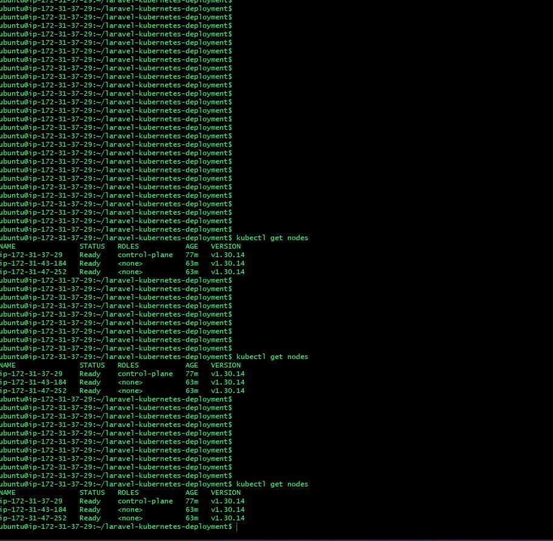
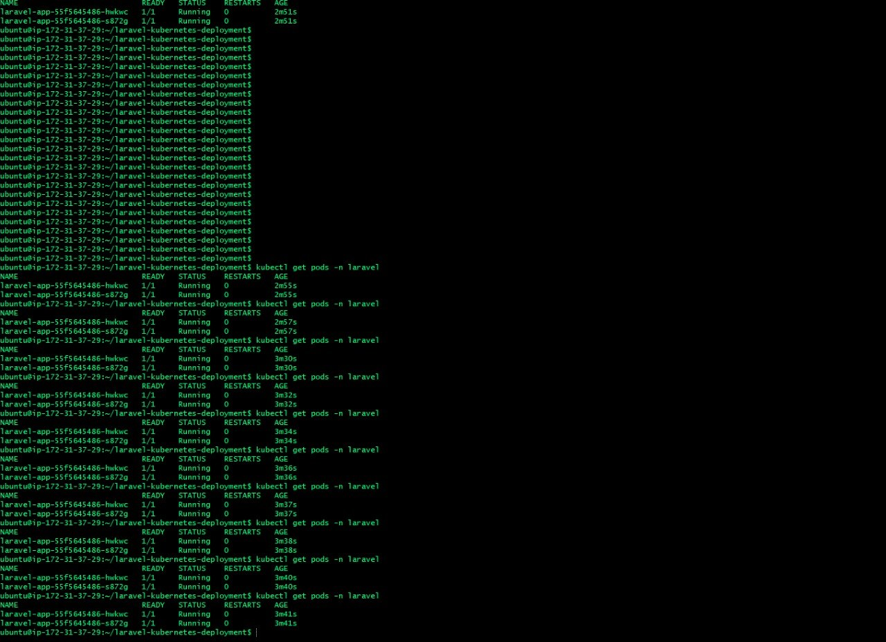
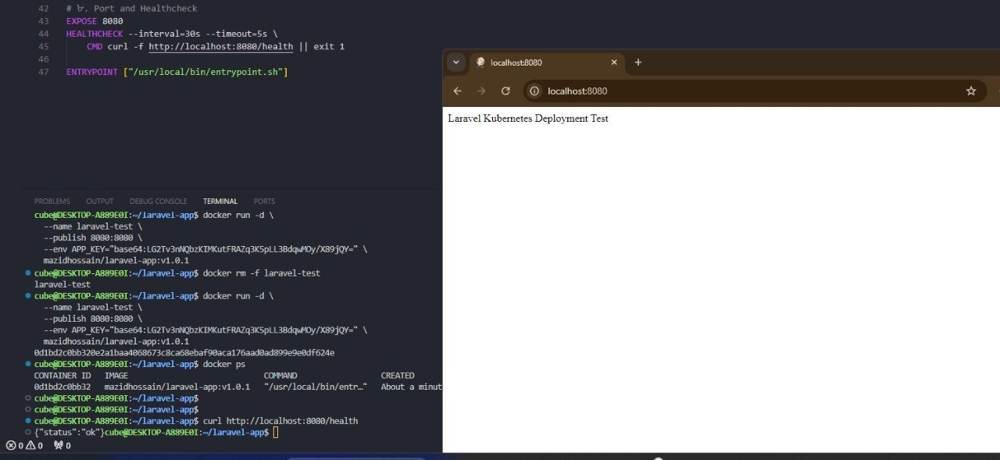
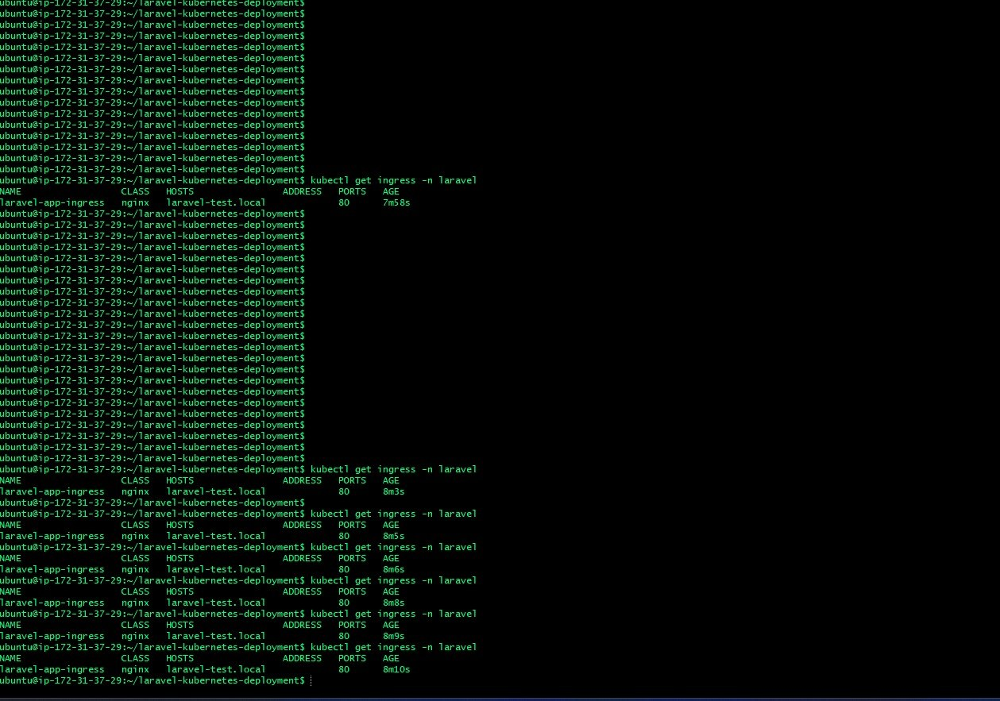

# Laravel Kubernetes Deployment # 

**This repository contains a full-scale deployment of a Laravel 11 application on a self-managed Kubernetes cluster using Kubeadm, Docker, and Helm.**

## 📌 Project Overview 
  App: Laravel 11 (PHP 8.3-FPM + Nginx)
  Cluster: Kubeadm (1 Control-plane, 2 Worker nodes)
  CNI: Calico
  Ingress: Nginx Ingress Controller
  Registry: Docker Hub - mazidhossain/laravel-app

## 🛠 1.Laravel Application & Docker Setup
### Application Features
 Route /: Displays "Laravel Kubernetes Deployment Test".
 Health Check /health: Returns {"status": "ok"} for Kubernetes Liveness and Readiness probes.

## Docker Image Architecture
I used a multi-stage build to ensure the image is lightweight and secure.
 Base: PHP 8.3-FPM Alpine.
 Server: Nginx + Supervisor (to manage both PHP and Nginx processes).
 Security: Non-root user (www-data) for runtime.
 Healthcheck: Docker native health check via curl.

### Build and Push Commands:
# Navigate to app directory
cd laravel-app

# Build the image with versioning
`docker build -t mazidhossain/laravel-app:v1.0.1 .`
`docker tag mazidhossain/laravel-app:v1.0.1 mazidhossain/laravel-app:latest`

# Push to Docker Hub
`docker push mazidhossain/laravel-app:v1.0.1`
`docker push mazidhossain/laravel-app:latest`

**Registry URL:** https://hub.docker.com/r/mazidhossain/laravel-app

## 🏗 2. Kubernetes Cluster (kubeadm) 
The cluster is built on AWS EC2 instances with Ubuntu 22.04.
 Cluster Details:
 Kubernetes Version: v1.30.14
 Nodes:
 1 Master (Control-plane)
 2 Worker nodes
 Status: All nodes are in Ready state (Verified with kubectl get nodes).

## Setup Commands (Summary):
1.Initialize Master: sudo kubeadm init --pod-network-cidr=192.168.0.0/16
2.Network Plugin: Calico CNI.
3.Ingress Controller: Nginx Ingress Controller (v1.10.1).

## ☸️ 3. Helm Chart Deployment
The application is deployed using a custom Helm chart located in helm-chart/laravel-app.
 Resources Managed by Helm:
 Deployment: 2 Replicas, Multi-stage image, Probes.
 ConfigMap: For APP_ENV and application configurations.
 Secret: For APP_KEY (Base64 encoded).
 Service: ClusterIP for internal routing.
 Ingress: Configured for laravel-test.local.
 PVC: Persistent storage for Laravel logs and cache.
 Init Container: Used to fix storage permissions (chown -R www-data) before the app starts.

### Deployment Commands:
## Create namespace
'kubectl create ns laravel'

## Install via Helm
'helm install laravel-app ./helm-chart/laravel-app -n laravel'

## Upgrade if changes occur
'helm upgrade laravel-app ./helm-chart/laravel-app -n laravel'

## Create namespace
'kubectl create ns laravel'

## Install via Helm
'helm install laravel-app ./helm-chart/laravel-app -n laravel'

## Upgrade if changes occur
'helm upgrade laravel-app ./helm-chart/laravel-app -n laravel'

# 🔒 4. Production Awareness & Security
**Non-root Container:** The image runs as www-data (UID 1000).
**Sensitive Data:** APP_KEY is never hardcoded; it is injected via Kubernetes Secrets.
**Storage Persistence:** Used PVC to ensure Laravel storage survives pod restarts.
**Resource Management:** CPU and Memory requests/limits are set in the Helm chart.
**Post-Deployment:**
 Optimization: php artisan config:cache and route:cache are executed in the entrypoint.

## 🌐 5. Verification & Testing
## 1. External Access (Ingress)
Map the host laravel-test.local to your cluster's Ingress IP in /etc/hosts:

'<INGRESS_IP> laravel-test.local'

## 2. Test Endpoints
 Home: http://laravel-test.local (Expect: "Laravel Kubernetes Deployment Test")
 Health: curl http://laravel-test.local/health (Expect: {"status":"ok"})

## 3. CLI Verification
'kubectl get nodes'
'kubectl get pods -n laravel'
'kubectl get ingress -n laravel'

## 🛠 6. Troubleshooting
**Permission Errors:** Handled by the initContainer in deployment.yaml.
**Pod Pending:** Ensure your cluster has a StorageClass or a manual PV is provided for the PVC.
**Nginx Error:** Check logs with kubectl logs <pod_name> -c nginx -n laravel.

## Proof of Working (Screenshots Summary):
✅ Nodes are Ready (v1.30.14)
✅ Pods are Running (2 replicas)
✅ Ingress mapped to laravel-test.local
✅ Docker Image pushed and tested locally on port 8080.

### 📸 Verification Proofs

#### 1. Cluster Nodes Status (`kubectl get nodes -o wide`)

#### 2. All Running Pods (`kubectl get pods -n laravel`)

#### 3. App Health & Docker Verification (Local Test & /health)

#### 4. Ingress Configuration (`kubectl get ingress -n laravel`)

**Developed by Md Mazid Hossain**
